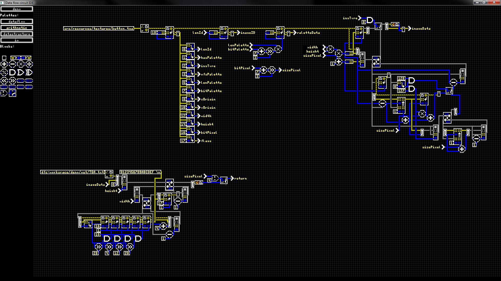

"Data Flow Circuits" is a hobby project, where I'm creating a data flow oriented programming language with a graphical editor.

As part of my Minecraft mod RedstoneControl, I had previously implemented a runtime compiler that would translate a data flow graph into JVM byte code in order to efficiently emulate player build logic circuits.
Now I decided to turn that concept into a complete programming language for writing regular programs that run on computers in the real world.

The language is real-time interpreted, meaning it runs immediately as you program it and lets you see the intermediate computation results by hovering over wires in the editor. It has only one data type called "signal" which is effectively a struct passed by value that consists of a type token, a reference to an array of signals, a reference to an array of bytes and a 64-bit integer. Thereby signals serve as universal building blocks for any data structure.

The main purpose of this language is to serve as preprocessor / type checker / generator for other programming languages or data formats but it can also be used directly to explore data structures, test algorithms or perform small quick tasks. The syntax can be extended via macros and java plug-ins if necessary.

*The above example parses a TGA-image file and turns it into a formatted grid of ARGB-hex codes that is output into a text file.*

The editor is using OpenGL-2.0 and GLFW from [LWJGL-3.2.1](https://www.lwjgl.org/) for rendering and inputs.

## Features (implemented and planned):

**Language:**
- [x] arithmetic, logic and comparison with integers
- [ ] floating point arithmetic
- [x] signal and byte array operations for creating arbitrary data structures
- [ ] hash maps and array lists (in standard library)
- [x] conditional switches
- [x] loops
- [x] functions
- [x] macro blocks
- [ ] polymorphic function calls based on type tokens
- [x] basic file I/O
- [ ] advanced file I/O (interaction with directory structures)
- [x] Java Plugin API (but subject to changes)

**Editor:**
- [x] data flow graph editor
- [x] panning and zooming
- [x] load / save source graph files
- [x] real time evaluation in editor
- [x] multi-selection for movement and deletion
- [x] improved block palette
- [x] project organization into modules
- [ ] menu for project overview (module list)
- [ ] improved signal type inspection (as tree)
- [x] text auto-completion for block arguments
- [ ] copy & paste
- [ ] undo
- [ ] routing assistance
- [ ] customizable key-binds
- [ ] multiple open circuit tabs

## Editor Controls

Scroll on the board to zoom the view.  
Right-click-drag on the board to move it around.  
Scroll on the block palette to slide it sideways.  
Middle-click to clone a selected circuit block.  

Left-click ...
- in the block palette to spawn a new block of the selected type. Click again on the board to place it.
- a pin or trace node to draw a trace, click again to place a new trace node or connect the trace to a selected node / pin.
- drag a trace node to move it (pushing a node on top of another will connect them).
- a text containing block to edit it (click somewhere else to end text edit mode).
- drag a block to move it (overlapping pins will auto-connect).
- drag from an empty position to select multiple blocks and traces to be moved after release. Then click again to finish movement.

Key-bindings:
- `CTRL`+`W`: close application
- `CTRL`+`O`: open the circuit schematic for the hovered block. Blocks can also be opened via right-click in the block palette. Note: save your current circuit schematic before opening another one!
- `CTRL`+`S`: save currently open circuit schematic (will also recompute signal table for `const` blocks).
- `CTRL`+`D`: remove all orphaned traces.
- `DELETE`: delete the selected circuit block.
- `HOME`: center view on (0, 0) origin of the circuit board.

In text editing:
- `LEFT_ARROW`, `RIGHT_ARROW`: move cursor left / right
- `SHIFT` + (`LEFT_ARROW`, `RIGHT_ARROW`) or drag mouse cursor: select text
- `CTRL`+`A`: select all
- `CTRL`+`C`: copy selected text to clip-board
- `CTRL`+`V`: insert clip-board at cursor
- `CTRL`+`X`: cut selected text and store it in clip-board
- `BACKSPACE`, `DELETE`: delete selected text or character left/right to cursor.
- `UP_ARROW`, `DOWN_ARROW`: change selected auto-completion to next up/down in list.
- `TAB`: apply selected auto-completion.
- `ENTER`, `NP_ENTER` or click outside text-field: finish editing (changes will take effect).
- `PAGE_UP`, `PAGE_DOWN`: move cursor to next argument up/down in current block.

Note: Editing a block's text may change its size and move it around but it will not automatically connect I/O pins this way.

## Running the Application

The editor is started by running its main class `cd4017be.dfc.editor.Main.java` or the compiled jar archive with:

`java -jar DataFlowCircuits.jar <project-root-dir> <module-name> <block-name>`

Replace `<project-root-dir>` with the root directory that contains all your modules as sub directories.
Replace `<module-name>` with the name of the module to open (modules are saved in `<project-root-dir>/<module-name>/module.dfc`).
And replace `<block-name>` with the name of the block to open within that module (blocks are saved in `<project-root-dir>/<module-name>/blocks/<block-name>.dfc`). The `<block-name>` argument can be omitted to open the module definition instead.
