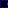
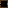
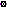
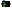
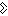
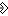
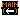

## Constants:

- .
-  outputs a function pointer to the externally declared function with the given name and the signature specified by the input function type.
-  outputs a constant zero-initialized value of same type as the input signal. Integer types are set to `0`, floating point types to `+0.0` and pointer and function types to `null` (null-pointer). Aggregate types are zero-initialized element wise.

## Arithmetic:
These operators accept integer (**w, s, i, l, W, S, I, L**) and floating point (**F, D**) inputs, but both inputs must be of the same type.
If the inputs are bundles of more than one signal, the operation is performed element-wise.
The output has the same type as the inputs and will be constant if both inputs are constant.

-  outputs the arithmetic negation of the input (has only one).
-  outputs the sum of the two inputs.
-  outputs the top input minus the bottom input.
-  outputs the product of the two inputs.
-  outputs the division of the top input by the bottom input. *[1]*
-  outputs the division remainder of the top input by the bottom input. If signed, the output has the same sign as the dividend. *[1]*
-  outputs the sum of all elements in the input signal. *[3]*
-  outputs the product of all elements in the input signal. *[3]*

*[1] : Integer division by zero has undefined behavior at runtime and is a compile error if it's constant.*  
*[2] : Not supported for floating point types.*  
*[3] : Output has only one element and all input elements must be of same type.*

## Bitwise Logic:
These operators accept integer (**w, s, i, l, W, S, I, L**) and boolean (**b**) inputs, but both inputs must be of the same type.
If the inputs are bundles of more than one signal, the operation is performed element-wise.
The output has the same type as the inputs and will be constant if both inputs are constant.

-  outputs the logical/bitwise negation of the input (has only one).
-  outputs the logical/bitwise OR of the two inputs.
-  outputs the logical/bitwise AND of the two inputs.
-  outputs the logical/bitwise exclusive-OR of the two inputs.
-  outputs the logical/bitwise not-OR of the two inputs.
-  outputs the logical/bitwise not-AND of the two inputs.
-  outputs the bits of the left input shifted to the left by the top input. *[3]*
-  outputs the bits of the left input shifted to the right by the top input. If signed, bits shifted in copy the sign bit, otherwise they fill with zeros.*[1]*
-  outputs true if any element in the input is true. *[2]*
-  outputs true only if all elements in the input are true. *[2]*

*[1] : Not supported for booleans.*  
*[2] : Output has only one element and all input elements must be boolean.*

## Comparison:
These operators accept integer (**w, s, i, l, W, S, I, L**), floating point (**F, D**) and pointer (**[], ()**) inputs, but both inputs must be of the same type (pointers may have different data structure types).
If the inputs are bundles of more than one signal, the operation is performed element-wise.
The output is always of type boolean and will be constant if both inputs are constant and not pointers.

-  outputs true if both inputs are equal.
-  outputs true if both inputs are not equal.
-  outputs true if top input is less than bottom input. *[1]*
-  outputs true if top input is greater than bottom input. *[1]*
-  outputs true if top input is less than or equal bottom input. *[1]*
-  outputs true if top input is greater than or equal bottom input. *[1]*

*[1] : Not supported for function pointers. And ordered comparison of data pointers is only meaningful if they both point to parts of the same data structure.*

## Casts:

-  casts b w s i l W S I L f d <-> b w s i l W S I L f d.
-  casts by reinterpreting the binary data. The input source data must have the same compact binary size as the target type. Casts between number/boolean and pointer types are not allowed. Pointer -> Pointer casts are only allowed if their structure types could also bit cast to each other or are of type unknown and the cast can not loosen access restrictions. Function -> Function casts can only apply legal target -> source bit casts on pointer parameter types and source -> target bit casts on pointer return types.

## Memory:

-  outputs a pointer to memory that is initialized with the input value. If the initializer is constant then the pointer is allocated as global variable, otherwise it is allocated on the stack and automatically freed when the current function returns. The input supports recursion.
-  outputs a pointer to allocated uninitialized memory.
-  Frees the memory allocated for the input pointer (if it's heap memory) and outputs nothing. The given pointer must have been created by the allocation operator above.
-  if given a pointer value as input will output a pointer to an element in the pointers data structure. The index input can be used to dynamically index arrays.
-  reads from memory referenced by the input pointer and outputs the data stored there.
-  writes the value from the top input to the memory referenced by the left input pointer and outputs the same pointer again.

## Control flow:

-  provides an external input signal for the current macro block through its output.
-  evaluates the output signal for the current macro block through its input. There must be exactly one such block inside every macro definition and its output should not be connected!
-  If the boolean top input is true then the left input is evaluated as output, otherwise the bottom input is evaluated as output. The types of both branches must be equal, except when the condition input is a constant then the unused branch is completely discarded by the compiler.
-  The output initially returns the bottom input. While the boolean top input evaluates to true, the left input is (re-)evaluated and provides the state of the output for the next iteration. Any circuitry not part of the loop will see the output in its final state that caused the loop condition to become false (assuming this eventually happens).
-  calls the function pointer from the left input with the parameter values from the top input and outputs the value returned by the call. If there is more that one function parameter, they must be provided as bundle.
-  defines a function with the signature specified by the top input and outputs a pointer to it. The left input is recursive and serves as return node of the implementation graph and must be compatible with the function's return type. Within that implementation graph, the function parameters can be obtained from the function pointer via  blocks (the first parameter is index 1).
-  defines the main() function of the program. The left input gets evaluated when the program is executed and represents the exit code as integer. The output is the function itself which has two parameters: `i argc` = the number of command line arguments given to the program. `[[W]*]* argv` = a pointer to an array of null-terminated strings (pointer to array of unsigned byte where the end is marked by a zero byte).

## Signals & Types

- ![Make vector][vector] outputs a vector. If the left input is not connected then the vector is initialized from the elements of the top input which must be a bundle where all elements are of same type (primitive or pointer). Otherwise the left input (must be a constant unsigned integer > 0) specifies the size of the vector and the top input specifies the element type (if non imaginary, its value is broadcast into all elements). The output is constant if the top input is fully constant, imaginary if the top input has imaginary contents and dynamic otherwise.
- ![Make array][array] outputs an array and works similar to ![vector][vector]. But it allows any element type and the size input can be 0 or unconnected to define a dynamically sized array. If the array is not constructed from bundle elements then the output is always imaginary (no element broadcasting).
- ![Make structure][struct] outputs a structure that is constructed from the elements of the input bundle. The output is constant if the input is fully constant, imaginary if the input is fully imaginary and dynamic otherwise. Note: only the last element of a structure is allowed to be dynamically sized and it will make the resulting structure dynamically sized as well.
-  outputs the top input bundle with the left input signal appended to it (or starts a new bundle if top is not connected). You can enter a name into the block to assign it to the signal element. These names will also appear in any structure or function types created from that bundle.
- ![Get element][get] extracts an element from an aggregate type or pointer to aggregate type signal given to the left input. The element to extract is specified by the index  you enter into the block (first element has index 0). Named elements can also be indexed by using their name instead. For nested aggregate types you can also enter a comma separated sequence of indices or names to do multiple indexing steps at once. You can write `#` for any index to make it use the unsigned integer value of the top input signal instead. A dynamic index signal is only allowed for indexing arrays or vectors in memory, otherwise it must be constant. Indexing into an imaginary signal of aggregate or reference type will yield an imaginary signal with the element type of that aggregate or reference (function return type has index 0 and first parameter has index 1).
- ![Set element][set] sets an element of the aggregate type top-right input to the value of the left input. Indexing works like with [get element][get] but it is only possible to set elements of structures, vectors or arrays that are **not** stored in memory. The block outputs the modified aggregate to the bottom which is always dynamic. If the top input aggregate may be imaginary, in which case its elements are "initialized" with undefined values.
- ![Element count][count] outputs the constant number of elements in the input signal as unsigned int. It outputs 0 for primitive types, 1 for pointer types and `#parameters + 1` for function types.
- ![Type of][type] outputs an imaginary signal with the same type as the input.
- ![Reference to][ref] when given an imaginary signal as input, it outputs an imaginary signal with the input type wrapped into a pointer (no operation is performed). The input supports recursion.
- ![Function type][funt] outputs an imaginary signal of type function pointer based on the return type from the left input and the parameter types (provided as bundle) from the top input.

[ref]: ../src/resources/textures/blocks/ref.png
[get]: ../src/resources/textures/blocks/get.png
[set]: ../src/resources/textures/blocks/set.png
[vector]: ../src/resources/textures/blocks/vector.png
[array]: ../src/resources/textures/blocks/array.png
[struct]: ../src/resources/textures/blocks/struct.png
[count]: ../src/resources/textures/blocks/count.png
[type]: ../src/resources/textures/blocks/type.png
[funt]: ../src/resources/textures/blocks/funt.png
